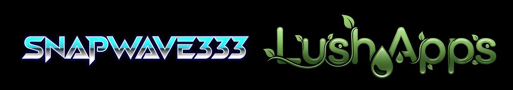

# 🎯 Who Wants to Be a Shillionaire?

<div align="center">
  
  
  **A Modern Desktop Trivia Game Experience**
  
  [](https://github.com/Snapwave333/whowantstobeashillonaire/releases)
  <a href="https://github.com/Snapwave333/whowantstobeashillonaire/actions/workflows/ci-cd.yml"></a>
  <a href="https://github.com/Snapwave333/whowantstobeashillonaire/actions/workflows/codeql.yml"></a>
  <a href="https://github.com/Snapwave333/whowantstobeashillonaire/actions/workflows/lint-frontend.yml"></a>
  <a href="https://github.com/Snapwave333/whowantstobeashillonaire/actions/workflows/lint-backend.yml"></a>
  <a href="https://github.com/Snapwave333/whowantstobeashillonaire/releases/latest"></a>
  <a href="https://app.codecov.io/gh/Snapwave333/whowantstobeashillonaire"></a>
  [](LICENSE)
  [](https://github.com/Snapwave333/whowantstobeashillonaire)
  <a href="https://snapwave333.github.io/whowantstobeashillonaire/docs/"></a>
  <a href="https://github.com/Snapwave333/whowantstobeashillonaire/pkgs/container/whowantstobeashillonaire-frontend"></a>
  <a href="https://github.com/Snapwave333/whowantstobeashillonaire/pkgs/container/whowantstobeashillonaire-backend"></a>
  <a href="https://img.shields.io/github/deployments/Snapwave333/whowantstobeashillonaire/github-pages?label=Pages"></a>
  <a href="https://ghcr.io/Snapwave333/whowantstobeashillonaire-frontend"></a>
  <a href="https://ghcr.io/Snapwave333/whowantstobeashillonaire-backend"></a>
  <a href="CONTRIBUTING.md"></a>
  <a href="CODE_OF_CONDUCT.md"></a>
  <a href="SUPPORT.md"></a>
  <a href="https://github.com/Snapwave333/whowantstobeashillonaire/stargazers"></a>
  <a href="https://github.com/Snapwave333/whowantstobeashillonaire/network/members"></a>
  <a href="https://github.com/Snapwave333/whowantstobeashillonaire/issues"></a>
  <a href="https://github.com/Snapwave333/whowantstobeashillonaire/pulls"></a>
</div>

---

<p align="center">
  
</p>

## 🧭 Table of Contents

- [🎮 About](#-about)
- [🚀 Quick Start](#-quick-start)
- [⬇️ Downloads](#️-downloads)
- [🎯 Game Modes](#-game-modes)
- [🛠️ Development](#️-development)
- [🎨 Customization](#-customization)
- [🤖 AI Integration](#-ai-integration)
- [📈 Project Stats](#-project-stats)
- [📋 Requirements](#-requirements)
- [🐛 Troubleshooting](#-troubleshooting)
- [📄 License](#-license)
- [👥 Contributing](#-contributing)
- [📞 Contact](#-contact)
- [🙏 Acknowledgments](#-acknowledgments)

## 🎮 About

**Who Wants to Be a Shillionaire** is a modern, AI-powered desktop trivia game that brings the excitement of the classic game show to your computer. Built with Electron and powered by Gemini AI, it features dynamic question generation, scaling difficulty, and a professional dual-window interface for hosts and contestants.

### ✨ Key Features

- 🤖 **AI-Powered Questions**: Dynamic question generation using Google's Gemini AI
- 🎯 **Scaling Difficulty**: Questions automatically scale from easy to expert level
- 🎨 **Modern UI**: Sleek dark theme with cinematic lighting and animations
- 🎮 **Dual-Window Setup**: Separate interfaces for Game Master and Contestant
- 🏆 **Customizable Prize Ladder**: Edit prizes, images, sounds, and display text
- 🎵 **Audio Integration**: Sound effects and ambient audio support
- 🔧 **Game Master Controls**: Full host control panel with API configuration
- 📱 **Responsive Design**: Optimized for various screen sizes

## 🚀 Quick Start

### Prerequisites

- **Node.js** (v16 or higher)
- **npm** or **yarn**
- **Git**

### Installation

1. **Clone the repository**
   ```bash
   git clone https://github.com/Snapwave333/whowantstobeashillonaire.git
   cd whowantstobeashillonaire
   ```

2. **Install dependencies**
   ```bash
   # Backend dependencies
   cd backend
   pip install -r requirements.txt
   
   # Frontend dependencies
   cd ../frontend
   npm install
   
   # Desktop app dependencies
   cd ../desktop-app
   npm install
   ```

3. **Configure API Key**
   - Get your Gemini API key from [Google AI Studio](https://aistudio.google.com/)
   - Enter it in the Game Master Settings when you first run the app

4. **Run the application**
   ```bash
   # Start the backend
   cd backend
   python app.py
   
   # Start the frontend (in another terminal)
   cd frontend
   npm start
   
   # Start the desktop app (in another terminal)
   cd desktop-app
   npm run dev
   ```

## ⬇️ Downloads

- **Get the latest build:** [Releases page](https://github.com/Snapwave333/whowantstobeashillonaire/releases/latest)
  - Windows installer: `.exe`
  - Portable archive: `.zip`

Note: Binaries are distributed via Releases only and are not committed to the repository.

## 🎯 Game Modes

### 🎮 Contestant Mode
- Clean, focused interface for players
- Real-time question display
- Lifeline integration (50/50, Phone a Friend, Ask the Audience)
- Prize ladder visualization

### 🎛️ Game Master Mode
- Full control panel for hosts
- AI question generation with difficulty scaling
- Prize ladder customization
- Game state management
- API configuration and testing

## 🛠️ Development

### Project Structure

```
whowantstobeashillonaire/
├── backend/                 # Flask API server
│   ├── app.py              # Main Flask application
│   ├── models/             # Database models
│   ├── routes/             # API endpoints
│   └── utils/              # AI integration utilities
├── frontend/               # React web application
│   ├── src/
│   │   ├── components/     # React components
│   │   └── context/        # Game state management
│   └── public/
├── desktop-app/            # Electron desktop application
│   ├── src/                # Main and renderer processes
│   ├── assets/             # Icons, images, sounds
│   └── build/              # Built React app
├── docs/                   # Documentation
└── README.md
```

### Building for Production

```bash
# Build the desktop installer
cd desktop-app
npm run build:installer

# Build the web version
cd frontend
npm run build
```

## 🎨 Customization

### Prize Ladder
- Edit prize amounts and display text
- Upload custom images and sounds
- Set safe haven levels
- Toggle between amount and text display

### Question Categories
- General Knowledge
- Science & Technology
- History
- Geography
- Sports & Entertainment
- Literature & Arts
- Random (AI-selected)

## 🤖 AI Integration

The game uses Google's Gemini AI for dynamic question generation:

- **Smart Difficulty Scaling**: Questions automatically increase in complexity
- **Category-Specific Content**: AI generates contextually appropriate questions
- **Quality Assurance**: Built-in validation ensures proper question format
- **Fallback System**: Sample questions available if API is unavailable

## 📈 Project Stats

<p align="center">
  
</p>
<p align="center">
  
</p>
<p align="center">
  
</p>

<h2> 🚀 &nbsp;Some Tools I Have Used for this and other projects</h2>
<p align="left">


</p>

## 📋 Requirements

### System Requirements
- **OS**: Windows 10/11 (64-bit)
- **RAM**: 4GB minimum, 8GB recommended
- **Storage**: 500MB available space
- **Internet**: Required for AI question generation

### Development Requirements
- **Node.js**: v16+
- **Python**: v3.8+
- **Git**: Latest version

## 🐛 Troubleshooting

### Common Issues

**API Connection Failed**
- Verify your Gemini API key is correct
- Check internet connection
- Ensure API key has proper permissions

**App Won't Start**
- Run `npm install` in all directories
- Check Node.js version compatibility
- Verify all dependencies are installed

**Questions Not Generating**
- Test API connection in Game Master Settings
- Check API key configuration
- Verify internet connectivity

## 📄 License

This project is licensed under the MIT License - see the [LICENSE](LICENSE) file for details.

## 👥 Contributing

1. Fork the repository
2. Create a feature branch (`git checkout -b feature/amazing-feature`)
3. Commit your changes (`git commit -m 'Add amazing feature'`)
4. Push to the branch (`git push origin feature/amazing-feature`)
5. Open a Pull Request

## 📞 Contact

- **Developer**: Snapwave333
- **Email**: [Your Email]
- **GitHub**: [@Snapwave333](https://github.com/Snapwave333)

## 🙏 Acknowledgments

- **Google Gemini AI** for question generation
- **Electron** for cross-platform desktop development
- **React** for modern web interface
- **Flask** for robust backend API

---

<div align="center">
  
  
  <p>Made with ❤️ by Snapwave333</p>

  <h2> 🚀 &nbsp;Some Tools I Have Used for this and other projects</h2>
  <p align="left">
  
  
  
  
  
  
  
  
  
  
  
  
  
  
  
  
  
  </p>
  <p>⭐ Star this repo if you like it!</p>
  
  
</div>
