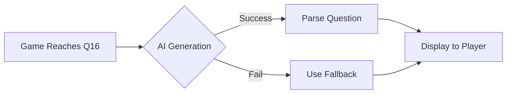

<div align="center">

# 🎯 Who Wants to Be a Shillionaire?


### 🚀 AI-Powered Trivia Game with Stunning Visual Effects

**Experience the thrill of the classic game show with modern tech!**

[](https://github.com/Snapwave333/whowantstobeashillonaire/releases)
[](LICENSE)
[](https://github.com/Snapwave333/whowantstobeashillonaire/stargazers)
[](https://github.com/Snapwave333/whowantstobeashillonaire/issues)

<a href="https://github.com/Snapwave333/whowantstobeashillonaire/actions/workflows/ci-cd.yml"></a>
<a href="https://github.com/Snapwave333/whowantstobeashillonaire/releases/latest"></a>

[🎮 Play Now](#-quick-start) • [📖 Documentation](#-table-of-contents) • [🐛 Report Bug](https://github.com/Snapwave333/whowantstobeashillonaire/issues) • [✨ Request Feature](https://github.com/Snapwave333/whowantstobeashillonaire/issues)

</div>

---

## 🌟 What's New

### Latest Updates (v1.0.0)

```diff
+ 🤖 FREE AI-Powered Question Generation using Hugging Face Mixtral-8x7B
+ ✨ Complete UI/UX Overhaul with stunning animations and effects
+ 🎯 15 Hand-Crafted Trivia Questions + Unlimited AI-Generated Questions
+ 🎨 Cinematic Glowing Borders and Visual Feedback
+ 🎮 Final Answer Confirmation Button (no more auto-submit!)
+ 💫 Active Tier Highlighting with Smooth Scrolling
+ 🎭 Enhanced Animations for Correct/Wrong Answers
+ 📱 Improved Settings Panel as Modal Overlay
+ 🔥 Better Game State Management and Transitions
```

---

## 🧭 Table of Contents

- [✨ Features](#-features)
- [🎬 Demo](#-demo)
- [🚀 Quick Start](#-quick-start)
- [🎮 How to Play](#-how-to-play)
- [🤖 AI Integration](#-ai-integration)
- [🛠️ Tech Stack](#️-tech-stack)
- [📁 Project Structure](#-project-structure)
- [🎨 Customization](#-customization)
- [🐛 Troubleshooting](#-troubleshooting)
- [🤝 Contributing](#-contributing)
- [📄 License](#-license)
- [👨‍💻 Author](#-author)

---

## ✨ Features

<table>
<tr>
<td width="50%">

### 🤖 AI-Powered
- **Free Hugging Face Integration**
- Mixtral-8x7B model for questions
- Dynamic difficulty scaling
- No API key required!
- Unlimited questions

</td>
<td width="50%">

### 🎨 Beautiful UI
- Cinematic glowing effects
- Smooth animations
- Dark theme with neon accents
- Responsive design
- Professional polish

</td>
</tr>
<tr>
<td width="50%">

### 🎯 Game Features
- 15 tiers with progressive difficulty
- 3 lifelines (50/50, Ask, Phone)
- Safe haven checkpoints
- Prize ladder tracking
- Auto-save functionality

</td>
<td width="50%">

### ⚙️ Customization
- Adjustable prize multipliers
- Configurable tier count
- Custom safe havens
- Difficulty settings
- Full game master control

</td>
</tr>
</table>

---

## 🎬 Demo

### Game Interface

```
┌─────────────────────────────────────────────────────────────┐
│  💰 PRIZE LADDER          │  ❓ QUESTION SECTION           │
│  ┌───────────────┐        │  ┌──────────────────────────┐  │
│  │ 15 | $1,000,000│ 🏆    │  │ What is the capital of   │  │
│  │ 14 | $500,000  │        │  │ France?                  │  │
│  │ 13 | $250,000  │        │  └──────────────────────────┘  │
│  │ 12 | $125,000  │        │                                │
│  │ 11 | $64,000   │        │  ┌────────┐  ┌────────┐       │
│  │ 10 | $32,000   │ 🛡️    │  │ London │  │  Paris │       │
│  │  9 | $16,000   │        │  └────────┘  └────────┘       │
│  │  8 | $8,000    │ ⭐     │  ┌────────┐  ┌────────┐       │
│  │  7 | $4,000    │        │  │ Berlin │  │ Madrid │       │
│  └───────────────┘         │  └────────┘  └────────┘       │
│                             │                                │
│                             │  [   FINAL ANSWER   ]         │
└─────────────────────────────────────────────────────────────┘
```

### ✨ Visual Effects

- **Glowing Borders**: Animated rainbow gradient borders
- **Hover Effects**: Ripple animations on buttons
- **Active Tier**: Pulsing gold highlight on current question
- **Answer Feedback**: Green (correct) / Red (wrong) animations
- **Loading State**: "🤖 Generating question with AI..." indicator

---

## 🚀 Quick Start

### 🎯 Instant Play (Recommended)

```bash
# 1. Clone the repository
git clone https://github.com/Snapwave333/whowantstobeashillonaire.git
cd whowantstobeashillonaire

# 2. Open and play!
open index.html  # macOS
start index.html # Windows
xdg-open index.html # Linux
```

**That's it!** The game works right out of the box with:
- ✅ 15 pre-loaded high-quality questions
- ✅ AI generates unlimited additional questions (FREE!)
- ✅ No setup, no API keys, no installation needed

### 🔧 Full Development Setup (Optional)

<details>
<summary>Click to expand full setup instructions</summary>

#### Prerequisites
- Node.js v16+ (for desktop app)
- Python 3.8+ (for backend API - optional)
- npm or yarn

#### Installation

```bash
# Install backend dependencies (optional - for advanced features)
cd backend
pip install -r requirements.txt

# Install frontend dependencies (optional - for React build)
cd ../frontend
npm install

# Install desktop app dependencies (optional - for Electron)
cd ../desktop-app
npm install
```

#### Running Components

```bash
# Backend API (optional)
cd backend
python app.py

# Frontend React App (optional)
cd frontend
npm start

# Desktop Electron App (optional)
cd desktop-app
npm run dev
```

</details>

---

## 🎮 How to Play

### Game Flow

1. **Start**: Open `index.html` in your browser
2. **Configure**: Adjust settings (optional) or click "START GAME"
3. **Answer**: Read the question and select your answer
4. **Confirm**: Click the golden "FINAL ANSWER" button
5. **Progress**: Climb the ladder to $1,000,000!

### Lifelines

| Lifeline | Description |
|----------|-------------|
| **50/50** | Removes two incorrect answers |
| **Ask Discord** | Shows poll results from the community |
| **Phone a Scammer** | Get advice from an "expert" |

### Win Conditions

- Answer all 15 questions correctly = **$1,000,000** 🏆
- Wrong answer? Fall back to last **Safe Haven** (Tiers 5, 10, 15)

---

## 🤖 AI Integration

### Powered by Hugging Face

```javascript
🎯 Model: Mixtral-8x7B-Instruct-v0.1
🆓 Cost: FREE (hosted on Hugging Face servers)
🔑 API Key: NOT REQUIRED
♾️  Questions: UNLIMITED
```

### How It Works



### Difficulty Scaling

| Tier | Difficulty | AI Prompt |
|------|------------|-----------|
| 1-2  | Easy       | Basic trivia |
| 3-5  | Medium     | Moderate challenge |
| 6-10 | Hard       | Advanced knowledge |
| 11-15| Expert     | Very difficult |

### Example AI-Generated Question

```json
{
  "text": "Which programming language was created by Guido van Rossum?",
  "answers": ["Java", "Python", "Ruby", "JavaScript"],
  "correctAnswer": "Python",
  "category": "ai-generated",
  "difficulty": "hard"
}
```

---

## 🛠️ Tech Stack

### Frontend
<p>


</p>

### AI & Backend
<p>


</p>

### Desktop & Build
<p>


</p>

### DevOps & Tools
<p>


</p>

---

## 📁 Project Structure

```
whowantstobeashillonaire/
│
├── 📄 index.html              # Main game file (START HERE!)
├── 🎨 styles.css              # Beautiful styling & animations
├── ⚙️  game.js                # Game logic + AI integration
│
├── 📂 backend/                # Optional Flask API
│   ├── app.py
│   ├── requirements.txt
│   └── utils/
│
├── 📂 frontend/               # Optional React app
│   ├── src/
│   │   ├── components/
│   │   └── context/
│   └── package.json
│
├── 📂 desktop-app/            # Optional Electron app
│   ├── src/
│   ├── assets/
│   └── package.json
│
├── 📂 assets/                 # Images & resources
├── 📂 docs/                   # Documentation
└── 📄 README.md               # You are here!
```

---

## 🎨 Customization

### Settings Panel

Access the Pump Master Control Panel to customize:

```javascript
🎚️ Prize Scale Multiplier    (0.1x - 5.0x)
🔢 Number of Tiers           (10 - 15)
🛡️  Safe Havens              (Select checkpoints)
📊 Difficulty Level          (Easy - Expert)
💰 Cryptocurrency Display    (BTC, ETH, SHILL)
```

### Modifying Questions

Edit `game.js` to add your own questions:

```javascript
this.questions = [
    {
        id: 1,
        text: "Your question here?",
        answers: ["Option A", "Option B", "Option C", "Option D"],
        correctAnswer: "Option C",
        category: "your-category",
        difficulty: "easy"
    },
    // Add more...
];
```

### Styling

Edit `styles.css` to customize colors, animations, and effects:

```css
/* Change primary color */
--primary-color: #ffd700;    /* Gold */
--secondary-color: #00ff88;  /* Green */
--accent-color: #4ecdc4;     /* Cyan */
```

---

## 🐛 Troubleshooting

<details>
<summary><b>Game won't load / blank screen</b></summary>

- Check browser console for errors (F12)
- Try a different browser (Chrome, Firefox recommended)
- Clear browser cache and reload
- Ensure JavaScript is enabled
</details>

<details>
<summary><b>AI questions not generating</b></summary>

- The game falls back to demo questions automatically
- Check internet connection
- Hugging Face API may be temporarily unavailable
- First 15 questions don't need AI (pre-loaded)
</details>

<details>
<summary><b>Animations not smooth</b></summary>

- Check GPU acceleration in browser settings
- Close other resource-intensive tabs
- Try reducing animation complexity in CSS
- Update graphics drivers
</details>

<details>
<summary><b>Mobile display issues</b></summary>

- Game is optimized for desktop/tablet
- Rotate device to landscape mode
- Zoom out if elements are cut off
- Consider using desktop version
</details>

### Still having issues?

📧 [Open an issue](https://github.com/Snapwave333/whowantstobeashillonaire/issues) with:
- Browser name & version
- Operating system
- Screenshot of the problem
- Console error messages

---

## 🤝 Contributing

We love contributions! Here's how to help:

### Ways to Contribute

```
🐛 Report bugs
💡 Suggest features
📝 Improve documentation
🎨 Design improvements
🧪 Write tests
🔧 Fix issues
```

### Contribution Steps

1. **Fork** the repository
2. **Create** a feature branch
   ```bash
   git checkout -b feature/amazing-feature
   ```
3. **Commit** your changes
   ```bash
   git commit -m 'Add amazing feature'
   ```
4. **Push** to the branch
   ```bash
   git push origin feature/amazing-feature
   ```
5. **Open** a Pull Request

### Development Guidelines

- Follow existing code style
- Add comments for complex logic
- Test thoroughly before submitting
- Update documentation if needed
- Keep commits atomic and descriptive

See [CONTRIBUTING.md](CONTRIBUTING.md) for detailed guidelines.

---

## 📄 License

This project is licensed under the **MIT License** - see the [LICENSE](LICENSE) file for details.

```
MIT License - You are free to:
✅ Use commercially
✅ Modify
✅ Distribute
✅ Sublicense
❗ Must include copyright notice
```

---

## 👨‍💻 Author

<div align="center">

### Snapwave333

[](https://github.com/Snapwave333)
[](https://snapwave333.github.io/whowantstobeashillonaire)

**Made with ❤️ and ☕**

</div>

---

## 🙏 Acknowledgments

Special thanks to:

- **Hugging Face** - For free AI model hosting
- **Mistral AI** - For the Mixtral-8x7B model
- **Google Fonts** - For Orbitron & Roboto Condensed
- **GitHub** - For hosting and CI/CD
- **You** - For playing the game! ⭐

---

## 📊 Project Stats

<div align="center">


</div>

---

<div align="center">

### ⭐ If you like this project, give it a star!

**Ready to play?** [Click here to start!](#-quick-start)


</div>
